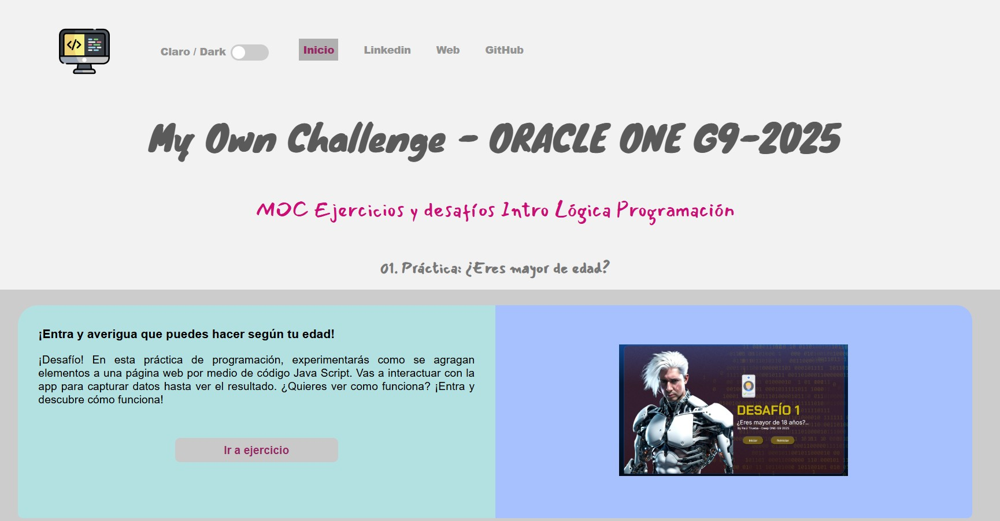
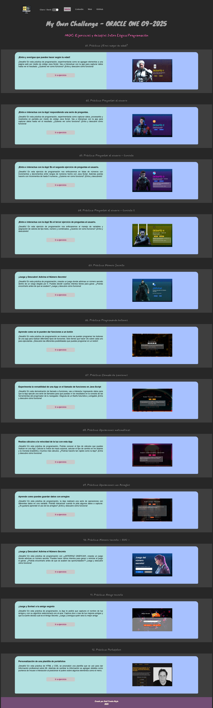
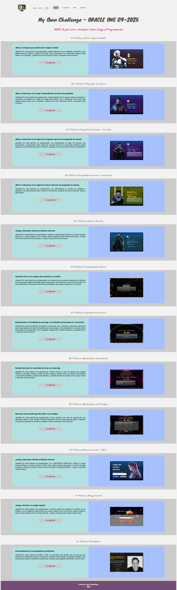

# 🌐 My Own Challenge - ORACLE ONE G9-2025

---

## ✨ **Descripción del Proyecto**

Este proyecto es un **índice interactivo de ejercicios y desafíos** realizados durante el programa **Oracle ONE - G9 (2025)**.  
Está diseñado para practicar **HTML, CSS y JavaScript**, con una interfaz moderna y adaptable que incluye:

✅ Menú con enlaces dinámicos  
✅ **Modo Claro / Dark** con interruptor  
✅ **Diseño responsivo** con menú tipo **hamburguesa**  
✅ Animaciones suaves en las secciones  
✅ Contenido cargado dinámicamente desde JavaScript  

---

## 🛠️ **¿Cómo funciona?**

Este sitio muestra una lista de **prácticas y desafíos** con:

- ✅ **Título y descripción** del ejercicio  
- ✅ **Imagen representativa**  

Cada entrada está generada dinámicamente con un **array en JavaScript** simulando lectura de registros a una base de datos.  
Además, cuenta con un **switch para cambiar entre modo claro y oscuro** en tiempo real.

---

## 🚀 **Características principales**

- 🎨 **Estilo moderno** con Google Fonts y paleta de colores amigable  
- 🌗 **Modo Dark/Light**  
- 📱 **Responsive Design** para móvil y escritorio  
- ⚡ **Contenido dinámico** desde `app.js`  
- 🖱️ Animaciones suaves en las tarjetas de ejercicios  

---

## 📸 **Vista Previa**

  
  

---

## 🧩 **Estructura del Proyecto**

📂 Proyecto  
├── 📄 index.html  
├── 📄 app.js  
├── 📂 styles/  
│   ├── style.css  
│   └── style_dark.css  
├── 📂 ima/  
│   ├── codigo.png  
│   ├── codigo.ico  
│   └── captura_pagina_completa.jpg  

---

### ✍ **Autor**

**Raúl Trueba Mejía**  
📌 CDMX, México  
🔗 [LinkedIn](https://www.linkedin.com/in/deepfx) | [Web](http://deepcontents.online) | [GitHub](https://github.com/deepsodome)
